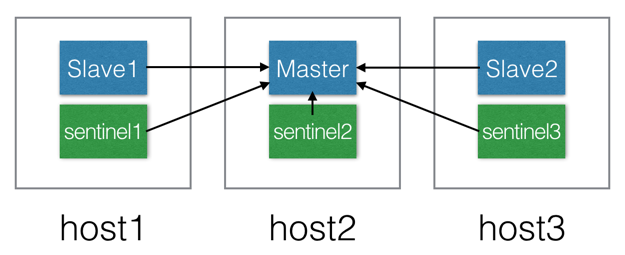
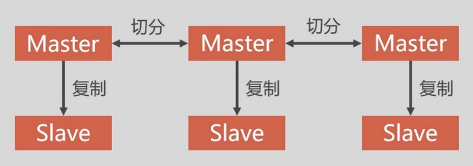

# Redis 集群

## Redis-Sentinel
> 高可用集群，同时只有一个 master，各实例数据保持一致



## Redis-Cluster
> 分布式集群，同时有多个 master，数据分片部署在各个 master 上
> 节点 ip 范围：172.10.15.11 - 16，开放端口 46374:46379、56374:56379
- 特点
    - 无中心节点，客户端与 redis节点直连，不需要中间代理层
    - 数据可以被分片存储，集群数据加起来就是全量数据
    - 可以通过任意一个节点，读写不属于本节点的数据
    - 管理方便，后续可自行增加或删除节点

    

- 结构特点
    - 所有的 redis 节点彼此互联(PING-PONG机制),内部使用二进制协议优化传输速度和带宽
    - 节点的 fail 是通过集群中超过半数的节点检测失效时才生效
    - Redis 集群预分好 16384 个哈希槽(hash slot)，当需要在 Redis 集群中放置一个 key-value 时，根据 CRC16(key) mod 16384 的值，决定将一个 key 放到哪个哈希槽中
    
    

- Redis-Cluster 采用无中心结构，每个节点保存数据和整个集群状态,每个节点都和其他所有节点连接
- 由于 Redis-Cluster 是分片存储，当集群中一个节点故障时，会损失该节点数据。为了实现高可用，需要对每个节点各添加一个从节点，形成主从同步
- 为了保证数据的高可用性，加入了主从模式，一个 master 对应一个或多个 slave ，master 提供数据存取，slave 则是从 master 拉取数据备份。当 master 挂了，就会从 slave 节点中选取一个来充当 master，从而保证集群不会挂掉
- 依赖

| 程序 | 版本  |
| ---- | ---- |
| ubuntu | 16.04 |
| docker | 18.09.1, build 4c52b90 |
| docker-compose | 1.17.1, build 6d101fb |
| redis | 5.0.5 |

- 建立集群
```bash
> cd /var/www/http/docker/redis/cluster

> docker-compose up -d
Creating network "redis_cluster-net" with the default driver
Creating redis-node-6 ... done
Creating redis-node-3 ... done
Creating redis-node-4 ... done
Creating redis-node-2 ... done
Creating redis-node-5 ... done
Creating redis-node-1 ... done

> docker ps
CONTAINER ID        IMAGE               COMMAND                  CREATED             STATUS              PORTS                                               NAMES
a4c9fc13b94b        redis:5.0.5         "docker-entrypoint.s…"   34 minutes ago      Up 34 minutes       0.0.0.0:46378->6379/tcp, 0.0.0.0:56378->56379/tcp   redis-node-2
ae35b2c82512        redis:5.0.5         "docker-entrypoint.s…"   34 minutes ago      Up 34 minutes       0.0.0.0:46377->6379/tcp, 0.0.0.0:56377->56379/tcp   redis-node-3
b3d3dd2c5c18        redis:5.0.5         "docker-entrypoint.s…"   34 minutes ago      Up 34 minutes       0.0.0.0:46376->6379/tcp, 0.0.0.0:56376->56379/tcp   redis-node-4
fbc91dfe0274        redis:5.0.5         "docker-entrypoint.s…"   34 minutes ago      Up 34 minutes       0.0.0.0:56379->56379/tcp, 0.0.0.0:46379->6379/tcp   redis-node-1
ddd307094e91        redis:5.0.5         "docker-entrypoint.s…"   34 minutes ago      Up 34 minutes       0.0.0.0:46375->6379/tcp, 0.0.0.0:56375->56379/tcp   redis-node-5
125ba63e2d62        redis:5.0.5         "docker-entrypoint.s…"   34 minutes ago      Up 34 minutes       0.0.0.0:46374->6379/tcp, 0.0.0.0:56374->56379/tcp   redis-node-6

> docker exec -it redis-node-1 bash

> redis-cli --cluster create 172.10.15.11:6379 172.10.15.12:6379 172.10.15.13:6379 172.10.15.14:6379 172.10.15.15:6379 172.10.15.16:6379 --cluster-replicas 1
>>> Performing hash slots allocation on 6 nodes...
Master[0] -> Slots 0 - 5460
Master[1] -> Slots 5461 - 10922
Master[2] -> Slots 10923 - 16383
Adding replica 172.10.15.15:6379 to 172.10.15.11:6379
Adding replica 172.10.15.16:6379 to 172.10.15.12:6379
Adding replica 172.10.15.14:6379 to 172.10.15.13:6379
M: 5f5d5d64f02f5b7b9df21c9e58aa5ea860749a15 172.10.15.11:6379
   slots:[0-5460] (5461 slots) master
M: 61d23b6fe5f5a7d2ff97cc9d33c192c6fc8dcd58 172.10.15.12:6379
   slots:[5461-10922] (5462 slots) master
M: 011d9587f7d2b11890bce67ea70f614fd726a881 172.10.15.13:6379
   slots:[10923-16383] (5461 slots) master
S: 472b162a3dd50ee8f805780be576cd21a292d3e2 172.10.15.14:6379
   replicates 011d9587f7d2b11890bce67ea70f614fd726a881
S: 81d44f046103351041bf0dd8cae8643269029354 172.10.15.15:6379
   replicates 5f5d5d64f02f5b7b9df21c9e58aa5ea860749a15
S: ef57b7c1b1378ad43fe396c5780a653a6989594f 172.10.15.16:6379
   replicates 61d23b6fe5f5a7d2ff97cc9d33c192c6fc8dcd58
Can I set the above configuration? (type 'yes' to accept): yes
>>> Nodes configuration updated
>>> Assign a different config epoch to each node
>>> Sending CLUSTER MEET messages to join the cluster
Waiting for the cluster to join
.....
>>> Performing Cluster Check (using node 172.10.15.11:6379)
M: 5f5d5d64f02f5b7b9df21c9e58aa5ea860749a15 172.10.15.11:6379
   slots:[0-5460] (5461 slots) master
   1 additional replica(s)
S: ef57b7c1b1378ad43fe396c5780a653a6989594f 172.10.15.16:6379
   slots: (0 slots) slave
   replicates 61d23b6fe5f5a7d2ff97cc9d33c192c6fc8dcd58
S: 81d44f046103351041bf0dd8cae8643269029354 172.10.15.15:6379
   slots: (0 slots) slave
   replicates 5f5d5d64f02f5b7b9df21c9e58aa5ea860749a15
M: 011d9587f7d2b11890bce67ea70f614fd726a881 172.10.15.13:6379
   slots:[10923-16383] (5461 slots) master
   1 additional replica(s)
S: 472b162a3dd50ee8f805780be576cd21a292d3e2 172.10.15.14:6379
   slots: (0 slots) slave
   replicates 011d9587f7d2b11890bce67ea70f614fd726a881
M: 61d23b6fe5f5a7d2ff97cc9d33c192c6fc8dcd58 172.10.15.12:6379
   slots:[5461-10922] (5462 slots) master
   1 additional replica(s)
[OK] All nodes agree about slots configuration.
>>> Check for open slots...
>>> Check slots coverage...
[OK] All 16384 slots covered.
```

- 测试集群连接
```bash
> redis-cli -h 172.10.15.11 -p 6379 -c

172.10.15.11:6379> cluster info # 查看集群信息
cluster_state:ok
cluster_slots_assigned:16384
cluster_slots_ok:16384
cluster_slots_pfail:0
cluster_slots_fail:0
cluster_known_nodes:6
cluster_size:3
cluster_current_epoch:6
cluster_my_epoch:3
cluster_stats_messages_ping_sent:343
cluster_stats_messages_pong_sent:371
cluster_stats_messages_meet_sent:1
cluster_stats_messages_sent:715
cluster_stats_messages_ping_received:367
cluster_stats_messages_pong_received:344
cluster_stats_messages_meet_received:4
cluster_stats_messages_received:715

172.10.15.11:6379> set user cwang
-> Redirected to slot [5474] located at 172.10.15.12:6379
OK
```